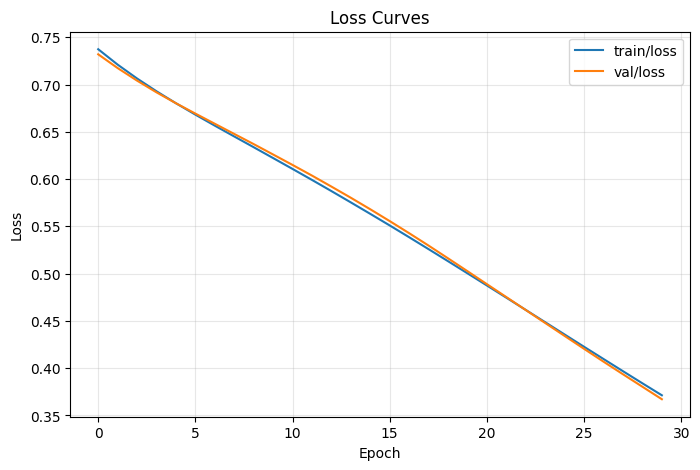
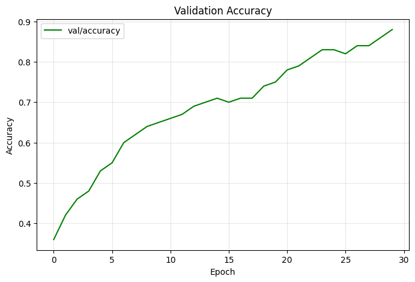

# Experiment Report: Dummy MLP — seed 42

**Date:** 2026-04-05__22-24-26
**Run name:** dummy-mlp-seed42

## TL;DR

2-layer MLP (10->16->1) trained on synthetic binary classification for 30 epochs. Final val_accuracy=0.8800, val_loss=0.3672.

## Config

| Parameter | Value |
|-----------|-------|
| n_samples | 500 |
| input_dim | 10 |
| hidden_dim | 16 |
| epochs | 30 |
| lr | 0.01 |
| seed | 42 |

## Results

| Metric | Value |
|--------|-------|
| final/val_loss | 0.3672 |
| final/val_accuracy | 0.8800 |

## Loss Curves

## Validation Accuracy

## W&B

- **Entity:** brando-su
- **Project:** dummy-experiment-test
- **Report URL:** N/A (offline or no API key)
