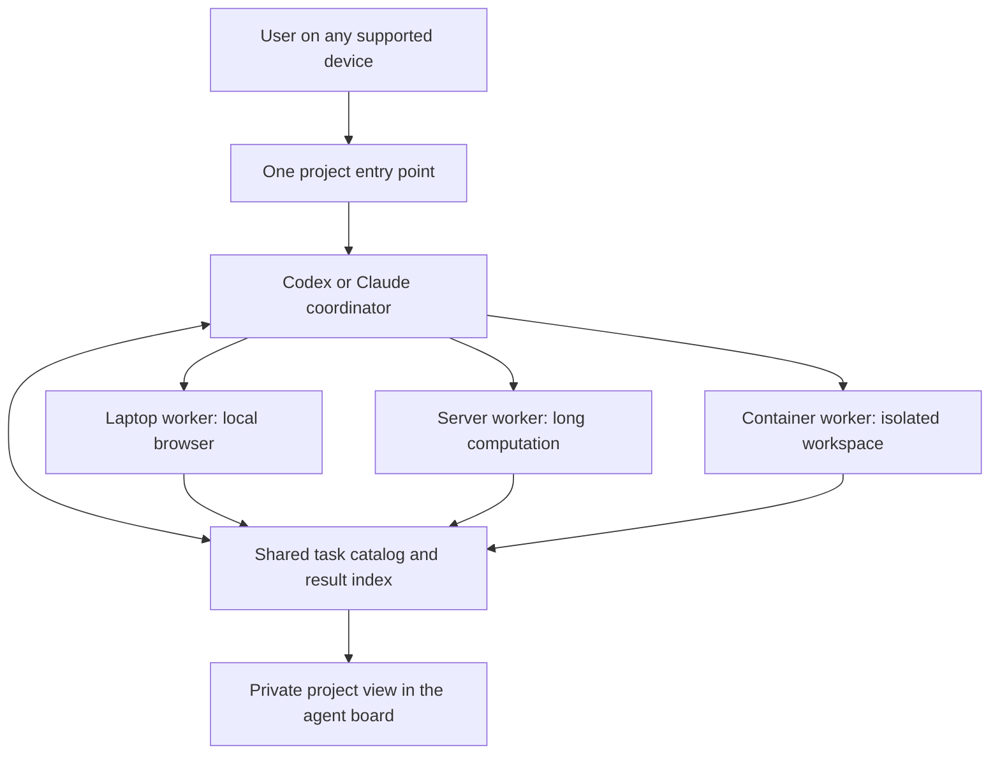

# One project across agent tools and computers

**Doc link:** <https://github.com/brando90/agents-config/blob/main/workflows/cross-machine-projects.md>

**TLDR:** Give each real project one identity, one task catalog, and durable context while allowing its agents to run on different computers and in different tools. Reuse native remote features and the existing agent board; add coordination only where provider, account, or host boundaries require it.

Design date: 09-24-2026. Status: proposed architecture and acceptance plan; no deployment or cross-host execution is certified by this document. This proposal does not change the execution, funding, permissions, or recovery rules in `~/agents-config/INDEX_RULES.md`.

**A project should retain its identity when its workers change computers or tools.**

The intended experience is one project entry point from which a user can discover tasks, send authorized work, inspect results, and continue from another device. A task may run on a laptop, a server, or a supported container. Its execution location remains visible because files, browser sessions, installed software, and network access differ between hosts.

Three capabilities need separate treatment:

| Capability | What it provides | What remains separate |
|---|---|---|
| Remote access | Control the same host's project from another device. | The controlling device's files and browser are not automatically shared. |
| Shared project view | List related tasks across hosts and tools. | Grouping tasks does not grant access to their execution environments. |
| Task coordination | Dispatch, message, and resume workers using shared task records. | Each worker retains its account, permissions, and file ownership. |

One project need not become one enormous conversation. Keep distinct tasks and their native histories, with concise shared decisions and result references.

**Native features should supply the first implementation wherever possible.**

The following public documentation informed this design on 09-24-2026. Recheck the installed version, account access, and actual behavior before relying on a capability in a deployment.

| Surface | Useful documented capability | Design boundary |
|---|---|---|
| Codex remote connections | Connected desktop devices and Secure Shell (SSH) hosts provide remote projects; supported handoff transfers a task and Git state between matched projects. | Tools and files belong to the execution host. Handoff is a transfer, not simultaneous shared execution. [Remote connections](https://learn.chatgpt.com/docs/remote-connections) |
| Codex project folders | Local projects support multiple folders; remote projects currently support one folder. | Folder attachment is not a documented universal project across hosts and vendors. [Projects and chats](https://learn.chatgpt.com/docs/projects) |
| Claude Code Remote Control | Server mode can serve multiple sessions; existing sessions can be exposed remotely. | Sessions still execute on their host. [Remote Control](https://code.claude.com/docs/en/remote-control) |
| Claude cross-session messaging | Eligible sessions can discover and message local, remote, and cloud sessions. | Messages do not transfer files or complete histories; connection, account, permissions, and listing limits apply. [Cross-session messaging](https://code.claude.com/docs/en/cross-session-messaging) |
| ChatGPT Work | Desktop capabilities overlap with Codex; hosted tasks can continue without an available personal computer. | Verify task visibility in each surface; no custom bridge should be built for behavior already provided natively. [Desktop and execution comparison](https://learn.chatgpt.com/docs/use-chatgpt) |
| Cloud execution | Work Cloud and repository-oriented Codex cloud have documented hosted execution paths. | Neither should be assumed to expose an arbitrary persistent server or inherit a laptop's environment. [Work overview](https://learn.chatgpt.com/docs/enterprise/chatgpt-work-overview), [Codex cloud](https://learn.chatgpt.com/docs/cloud) |
| Claude Cowork projects | Organize task context, instructions, and memory. | The documented project feature has limitations distinct from Claude Code. Verify integration before treating their project stores as interchangeable. [Cowork projects](https://support.claude.com/en/articles/14116274-organize-your-tasks-with-projects-in-claude-cowork) |

These features support parts of the goal. They do not establish one native project object spanning every vendor, account, and host. A sidebar section is useful organization, but is not proof of shared context or file access.

**Start with one home project and extend the existing board.**

Choose an existing authorized host for the main coordinating session and open its project remotely from other devices. Dispatch work according to the tools and files it needs: browser work to the correct desktop, long computations to an approved execution host, and isolated work to a container whose runtime and authentication have been verified.

The diagram describes proposed connections. Native tools should handle discovery, messaging, and resume where available. For the remaining cases, adapters—small connectors to each execution system—use approved locally authenticated command-line interfaces (CLIs) and existing private connections. A Model Context Protocol (MCP) tool interface can expose the same task catalog to several clients later; an initial command-line interface is sufficient. Model calls remain on the approved CLIs, with no new direct model-provider application programming interface (API) calls.

Reuse `~/agents-config/scripts/agent_board.py` and the [existing board design](agent-board-design/design.md). Keep observation separate from task control: reading the board must not launch, restart, stop, or spend resources on a worker. The proposed coordinator supplies authorized actions separately.

**A shared task catalog makes identity explicit without copying credentials or live session databases.**

Assign one stable project identifier and explicitly map the working directory on each host to it. Matching directory names alone are insufficient. Keep deployment-specific mappings and task records in private storage; this public repository holds the reusable design and generic tooling.

| Record | Purpose |
|---|---|
| Project and task identifiers | Preserve identity across hosts, tools, and resumes. |
| Provider, account profile, native session identifier | Locate the correct session without conflating accounts. |
| Host reference, working directory, code revision | Identify where commands execute and which files they use. |
| Required and observed capabilities | Route work to the appropriate browser, software, or compute environment. |
| Agent activity, task state, observation time | Distinguish a running process, incomplete work, and stale evidence. |
| Checkpoint and result references | Let a different coordinator recover context and inspect outcomes. |
| Current owner, attempt identifier, request identifier | Distinguish retries and ownership transfers; detect duplicate dispatch. |

Use one authoritative writer for each task's control state. Workers can emit separate versioned status records, following the board design's source identity, restart, ordering, and freshness contract. Do not let several machines edit a shared live session database. Preserve native transcripts and share only the context and artifacts explicitly needed for coordination.

Treat a disconnected host as unavailable with last-known evidence. Before retrying a dispatch whose acknowledgement was lost, reconcile the request identifier with the worker; a network timeout does not prove the task never started. A coordinator takeover must establish ownership and account for the previous writer before issuing conflicting work. Existing [reliable dispatch](reliable-agent-dispatch.md) governs recovery.

**File ownership and availability remain explicit even with one project view.**

Choose an authoritative location for each artifact. Use Git worktrees—separate working copies of one repository—for concurrent code changes. Transfer patches, Git bundles, or selected result files through approved private connections. A path on one host must be translated or its file transferred before a worker elsewhere can use it. GitHub publication is not a prerequisite for coordination.

Project-specific decisions, checkpoints, and results belong with the project and its existing experiment or task structure. Shared launch and collection code belongs in `agents-config`. Credential material, endpoint mappings, browser sessions, native identifiers, and operational records remain private.

If the coordinating host sleeps, already-detached remote jobs may continue, but that coordinator cannot route new work. Preserve durable records so another authorized coordinator can take over deliberately. Continuous availability requires an approved always-on host; remote access alone does not provide it. Hosted cloud tasks participate only through verified supported interfaces, not an assumed general-purpose remote shell.

**Prove a small complete workflow before claiming universal coverage.**

The central uncertainty is whether two native execution systems can share reliable identity, dispatch, and result records without duplicate work. The following are proposed acceptance criteria, not reported test results:

1. Register two existing tasks, one Codex and one Claude, on two different hosts under one project. Require 2 of 2 records with correct host and account mapping, with zero worker restarts caused by discovery.
2. Dispatch one harmless authorized task to each through supported controls. Require 2 of 2 acknowledgements and 2 of 2 inspectable results tied to their request and attempt identifiers.
3. Route one task requiring a particular host's browser. Verify the actual execution host and the intended browser resource.
4. Disconnect one host. Require its task records to remain visible with stale evidence, with zero false completions and zero silent removals.
5. Simulate an acknowledgement loss and a coordinator restart. Recover both task identities and results without launching a duplicate attempt or issuing conflicting writes.

First inventory existing native coverage and reuse a verified host setup. Then add the explicit project mapping and task catalog, followed by missing control adapters. Extend to more accounts, hosts, containers, and hosted services only after the first workflow passes. Track supported, unsupported, and untested sources separately; a short task list is not a complete agent inventory.

Routine collection uses ordinary code rather than model turns. An optional prose summarizer has a separate usage budget. Keep the existing distinction between agent activity and verified task completion throughout.

**TLDR-end:** [agents-config: one-project] Keep one project identity and durable task records while using native Codex and Claude connections wherever possible. Extend the private agent board with explicit host/account mappings and separate authorized task controls; validate two hosts and two agent families before broadening coverage.

**Snapshot:** Proposed first acceptance scope: 2 hosts, 2 agent families, 2 acknowledged tasks, 2 inspectable results, and 0 duplicate attempts. Implementation measurements are not yet available.
